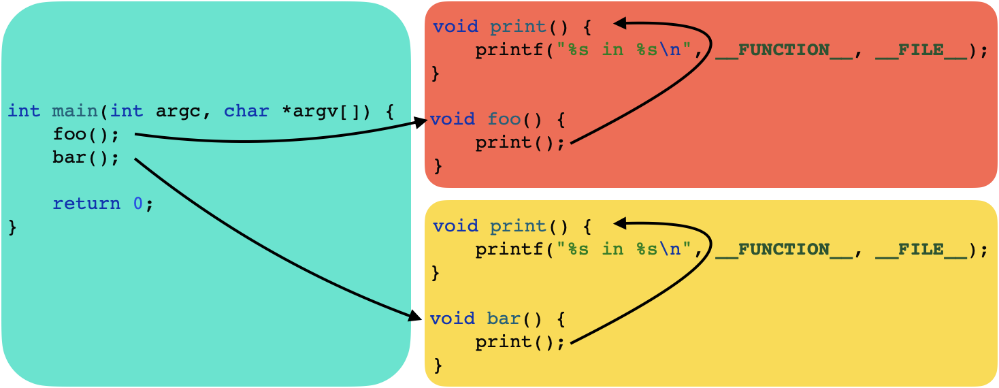
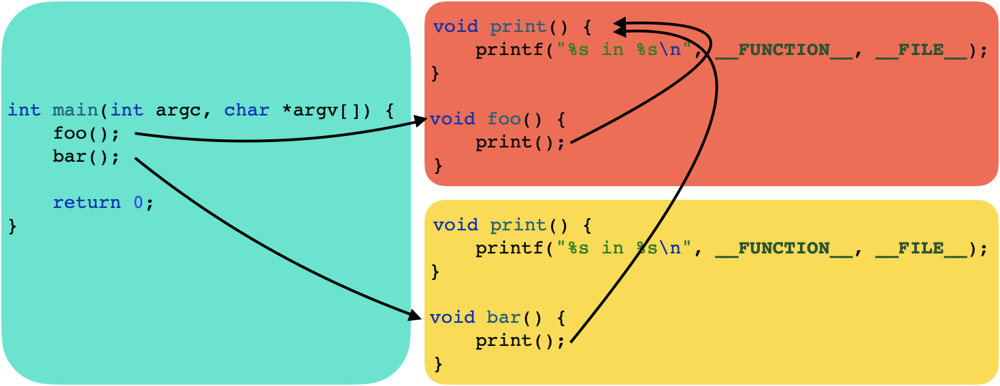

# Visibility

## 개요
사용하는 여러 동적 라이브러리에서 동일한 Symbol이 존재하는 경우 Symbol의 Binding과 Visibility에 프로그램이 예기치 않은 동작을 할 수 있습니다. 예제를
통해 Symbol의 Binding과 Visibility에 대해 자세히 알아보고 이해해봅니다.

## 설명
예제의 프로그램은 아래 그림과 같이 작성되어 있습니다. 프로그램은은 Foo, Bar 라이브러리를 사용하고 있고 각각의 라이브러리는 `print()`라는 동일한 함수를
구현하고 내부적으로 사용하고 있습니다. 그리고 개발자는 프로그램이 아래와 같이 동작할 것이라고 생각할 것입니다.



하지만 Symbol의 Binding과 Visibility에 따라 전혀 의도하지 않은 방향으로 프로그램이 동작할 수 있습니다. 아래 그림을 살펴보면 Bar 라이브러리의
`bar()`가 Foo 라이브러리의 `print()` 사용하는 것을 확인할 수 있습니다.



이렇게 의도지 않게 동작하는 이유는 동일한 이름의 Symbol이 있어서 충돌이 발생할 때 Symbol의 Binding과 Visibility에 따라서 어떤 Symbol을 사용할지 
결정되기 때문입니다.

### Symbol의 Visibility
컴파일러마다 Symbol의 Visibility의 표기법이 다르지만 의미는 비슷합니다. GCC는 Default, Hidden, Protected, Internal로 구분되고 Clang은
External, Non-external로 구분됩니다. 여기서는 Symbol이 외부에 노출되는 Default, External과 Symbol이 외부에 노출되지 않는 Hidden과
Non-external만 이해하고 있으면 됩니다.

- Default, External: Symbol이 외부에 노출되며 어떤 Symbol이 사용될지는 Symbol의 Binding에 의해서 결정됩니다.
- Hidden, Non-external: Symbol이 외부에 노출되지 않으며 내부의 Symbol을 사용하게 됩니다.

### Symbol의 Binding
컴파일러마다 Symbol의 Binding의 표기법이 다르지만 의미는 비슷합니다. GCC는 Local, Weak, Global로 구분되고 Clang은 Strong, Weak로 구분됩니다.

- Local, Strong: 내부의 Symbol을 사용합니다.
- Weak: PLT(Procedure Linkage Table)에 먼저 로드된 Symbol을 사용합니다.

### 결론
그러므로 Symbol의 Visibility가 Default, External이고 Symbol의 Binding이 Weak인 경우에 프로그램이 예기치 않게 동작하게 됩니다. `config.h`
를 아래와 같이 수정하면 프로그램이 예기치 않게 동작하는 것을 확인할 수 있습니다.

``` cpp
#if 1
#define SYMBOL_BINDING __attribute__((weak))
#else
#define SYMBOL_BINDING
#endif
```

```
print in CXX/Visibility/src/foo.cpp
print in CXX/Visibility/src/foo.cpp
```

또한 `CMakeLists.txt`에서 라이브러리 링킹 순서를 아래와 같이 변경하면 PLT에 먼저 로드되는 Symbol이 달라져서 호출되는 Symbol이 바뀌는 것을 확인할 수
있습니다.

```
target_link_libraries(Visibility Bar Foo)
```

```
print in CXX/Visibility/src/bar.cpp
print in CXX/Visibility/src/bar.cpp
```

`config.h`를 변경해서 빌드한 뒤 `nm`이나 `readelf`을 통해 Symbol의 Binding과 Visibility이 실제로 어떻게 변경되는지 확인할 수 있습니다.

```
nm -m libFoo.dylib
0000000000003f40 (__TEXT,__text) external __Z3foov
0000000000003f10 (__TEXT,__text) weak external __Z5printv
0000000000008010 (__DATA,__data) non-external __dyld_private
(undefined) external _printf (from libSystem)
(undefined) external dyld_stub_binder (from libSystem)
```
